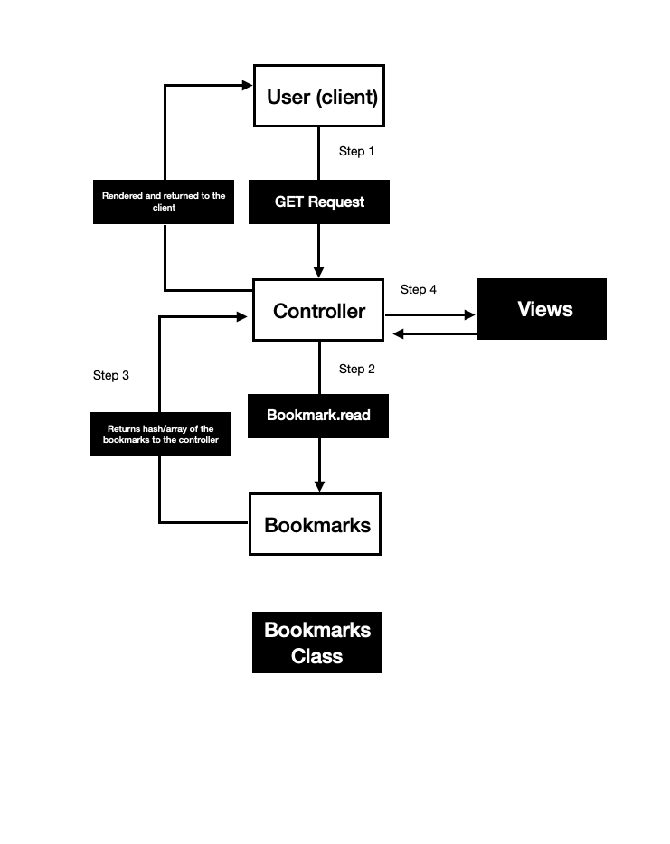

# Bookmark_Manager
#
*

# User Story one:
*As a user
*So I can view my bookmark pages
*I would like to see a list of bookmarks

# Create production and test environment using ./db/migrations/01_create_bookmarks_table in psql

# User Story two:
*As a user
*So I new bookmarks can be added to my view
* I would like add bookmarks to my *existing list

#User Story three:
*As a user
*So I can remove my bookmark from Bookmark *Manager
*I want to delete a bookmark

#User Story four:
*As a user
*So I can change a bookmark in Bookmark Manager
*I want to update a bookmark
